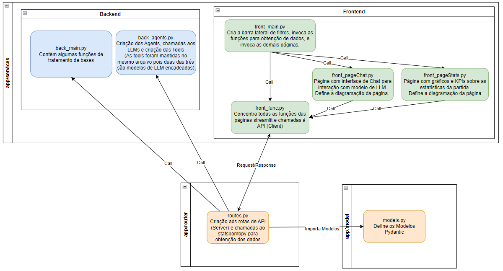
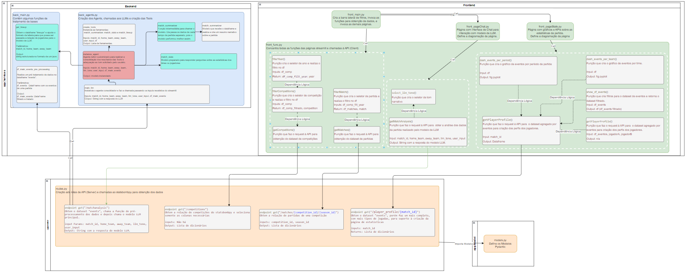

# Rodrigo_Mesquita_DR3_AT
## Desenvolvimento de Data-Driven Apps com Python [24E4_3]
### Link Github: https://github.com/rodrigo1992-cmyk/DR3_AT/tree/development

## Descrição do projeto e objetivo.
Este projeto tem por objetivo criar uma aplicação capaz de recuperar e exibir informações a respeito de partidas de futebol.
Para isto foram utilizados:
- Utilizada biblioteca **Streamlit** para criação de interface gráfica.
- Utilizado **FasAPI + Uvicorn** para comunicação entre o front-end e o back-end.
- Utilizado **Pydantic** para validação dos dados enviados via API.
- Utilizado **Langchain** para criação de Agents ReAct.
    - Utilizado o Agent **create_pandas_dataframe_agent** para input de direto de dataframes.
    - Utilizados prompts customizados do **LangSmith** para framework ReAct. 
- Utilizado o modelo **gemini-1.5-flash** para geração das análises.
- Utilizado **Seaborn** para criação de gráficos.

## Instruções para configurar o ambiente e executar o código.
- Instalar bibliotecas sinalizadas em requirements.txt. Também pode ser utilizado o arquivo PipFile (foi utilizado PipEnv durante o desenvolvimento).
- **Back-end**:
    1. Atualizar o caminho do projeto no comando sys.path.append() dos arquivos routes.py e back_agents.py
    1. Acessar a pasta app/router e executar o comando *"uvicorn routes:app --reload"*
- **Front-end**: Acessar a pasta app/services e executar o comando *"python -m streamlit run front_main.py --server.port=8081 --browser.serverAddress='177.192.12.238'"*

## Exemplos de entrada e saída das funcionalidades.
Foram criados dois diagramas, um com a arquitetura em alto nível (HLD), e outro com a arquitetura detalhada (LLD) contendo a descrição de todas as funções declaradas. Favor consultar os PDFs para visualização em resolução adequada.
- docs\arquitetura_HLD.png
- docs\arquitetura_LLD.png

### Snapshot do diagrama LLD:

### Snapshot do diagrama HLD:

